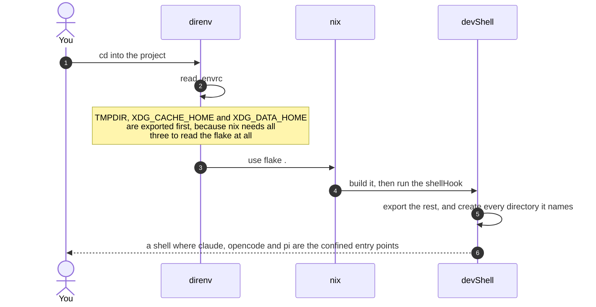
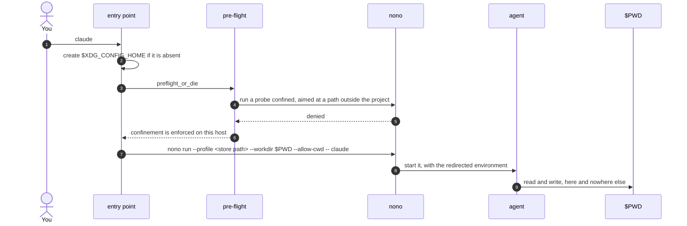
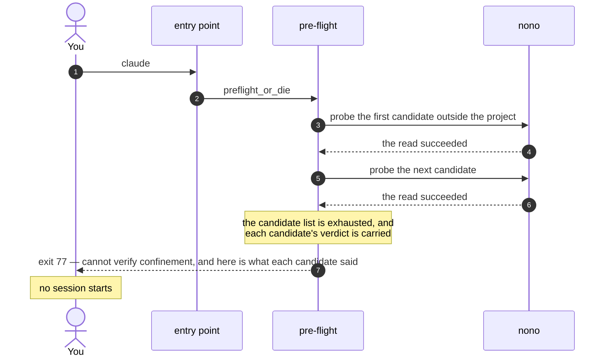
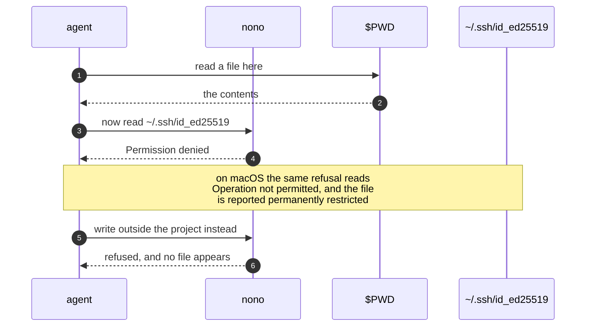

# agent-sandbox

A development environment you point a project at, which gives that project coding agents that are already configured and already confined to it.

**Project isolation is the product.** Nothing — credentials, caches, history, agent state — passes between the projects that use it.
There is nothing to deploy and nothing is delivered anywhere: what this repository ships is an environment a stranger enters with one command.

```sh
# Enter it from the published reference, in a directory of your own.
nix develop --accept-flake-config github:GRBurst/agent-sandbox
# Then type an agent's name. That name is the confined session.
claude
```

`--accept-flake-config` is not optional for most people: the substituter this flake declares is ignored for anyone who is not a trusted `nix` user, and without the flag the build falls back to source.
[docs/HANDBOOK.md](docs/HANDBOOK.md) is how to use it, including what it does not yet do.

## Components

Every row is what the file at that path actually does.

| Component | Where | What it does |
| --- | --- | --- |
| The agent table | `lib/agents.nix` | One entry per agent this environment knows how to confine: `claude-code`, `opencode`, `pi`. The set is closed, so a name that is not in it is an error rather than a default. |
| The leak registry | `lib/leak-registry.nix` | The single file naming every path outside the project and outside a session's own execution substrate that a session may still reach. Each entry justifies itself twice. It is **empty** today. |
| The confinement description | `lib/confinement.nix` | Builds one description per agent, with `$WORKDIR` left as a placeholder the mechanism expands at run time — so one reviewable artefact in the store serves every project. |
| The entry point | `lib/confined-agent.nix` | The wrapper each agent's own command name resolves to. `claude` inside the environment *is* the confined session; the raw binary is reachable only by store path. |
| The pre-flight | `lib/preflight.sh` | Runs before anything else starts and proves confinement is enforced *on this host*, by watching a confined probe be refused a path outside the project. It observes a denial rather than reading a kernel interface. |
| The environment | `flake.nix` | The devShell, the two systems it is built for, and the `shellHook` that points every tool's config, cache and temp path inside the checkout. |
| The bootstrap | `.envrc` | The three variables `nix` needs exported before it can read the flake at all. Their values are duplicated on purpose, and a check fails if the two files drift. |
| The verification | `scripts/validate.sh`, `scripts/checks/*.sh` | The single entry point for every claim this repository makes, over four layers — unit, component, integration, end to end. One exit status is the whole report. |
| The continuous run | `.github/workflows/verify.yml` | That same one command on both supported platforms, plus the one assertion no single machine can make: that the two grant the same reach. |
| The rules | `docs/CONSTITUTION.md`, `AGENTS.md` | What the code must be like, and how we work. Every plan is gated on the first. |

The flake's own outputs, per system:

```sh
nix build .#confinement-claude-code   # the description a session is confined by; jq . result is the whole review
nix build .#substrate-claude-code     # the store paths a session may execute; cat result/store-paths
nix build .#claude                    # the entry point itself, under the agent's own command name
nix build .#nono                      # the pinned mechanism, so a review reads the version the entry points enforce with
```

## Structure

```mermaid
flowchart LR
    ref["github:GRBurst/agent-sandbox"]
    flake["flake.nix"]
    table["lib/agents.nix"]
    registry["lib/leak-registry.nix"]
    generator["lib/confinement.nix"]
    description(["/nix/store/...-nono-profile-agent.json"])
    entry["lib/confined-agent.nix"]
    preflight["lib/preflight.sh"]
    mechanism["nono run"]
    agent["claude / opencode / pi"]
    project(["$PWD"])
    state(["$XDG_STATE_HOME/nono"])

    ref --> flake
    flake --> table
    flake --> registry
    table --> generator
    registry --> generator
    generator --> description
    description --> entry
    entry --> preflight
    preflight --> mechanism
    mechanism --> agent
    agent --> project
    mechanism --> state

    classDef outside stroke-dasharray: 5 5
    class state outside
```



A dashed outline is the one thing outside the project boundary.
`$XDG_STATE_HOME/nono` stays on the host because the mechanism anchors its own supervisory state there and refuses to start when any granted path overlaps it — so relocating it into the project would make the project ungrantable.
It is an accepted leak, enumerated as such in [docs/CONSTITUTION.md](docs/CONSTITUTION.md).

## What happens, in order

### Bootstrap



`XDG_CONFIG_HOME` has to **exist**, not merely be set: the mechanism falls back to the host's `~/.config` when the directory it names is absent, silently, which would let host configuration decide what a confined session may reach.

### Case 1: starting an agent



`--allow-cwd` is not decoration. It is the run-time consent that makes the working-directory grant happen at all; the description only sets its *level*.
Without the flag a non-interactive session reaches nothing but the store, while the resolved manifest still claims the project readwrite — so the manifest cannot be used to notice this.

### Case 2: refused, because this host cannot prove confinement



A refusal is the honest answer here, not a fallback.
A session that started without confinement having been *observed* would be a session whose whole guarantee rests on an assumption, so the pre-flight refuses and says which candidate said what.
The same refusal is what a project that **is** your home directory gets: there is no path left outside it to be refused.

### Case 3: refused, because the session reached outside its project



This is the demonstration, not a footnote: the read that succeeds is in the same session as the read that fails, so a session that never started cannot be mistaken for a session that was confined.
Every refusal check in the suite is built that way.

Note what is **not** confined here. Egress is *mediated*, not restricted: raw TCP is denied, but arbitrary HTTPS through the injected proxy succeeds, so a session asked to fetch a package reaches the registry.

## Verifying it

```sh
nix develop -c bash scripts/validate.sh   # the single entry point; every check, every layer
bash scripts/validate.sh --list           # name the checks without running them
bash scripts/validate.sh --layer unit     # one layer; unit and component need no devShell
nix flake check                           # evaluate the devShell for this system
```

It exits zero, and the count is the report: `35 checks passed` on `x86_64-linux`, `33 passed, 2 skipped` on `aarch64-darwin`.
A skip is not a pass — both are named, with the reason the platform forces them, under [Where the two platforms differ](docs/HANDBOOK.md#where-the-two-platforms-differ).
What a green run does **not** reach is listed under [What the automated run does not reach](docs/HANDBOOK.md#what-the-automated-run-does-not-reach), so every gap is a known one.

## Reading further

| | |
| --- | --- |
| [docs/HANDBOOK.md](docs/HANDBOOK.md) | How to use the repository today, what it guarantees, and its known drift |
| [docs/CONSTITUTION.md](docs/CONSTITUTION.md) | The principles every change is measured against, cited as `P1`…`P9` |
| [AGENTS.md](AGENTS.md) | How we work: the spec-driven workflow, the verification layers, the diagram rules |
| [specs/](specs/) | In-flight and historical work. Unchecked boxes are not backlog |
